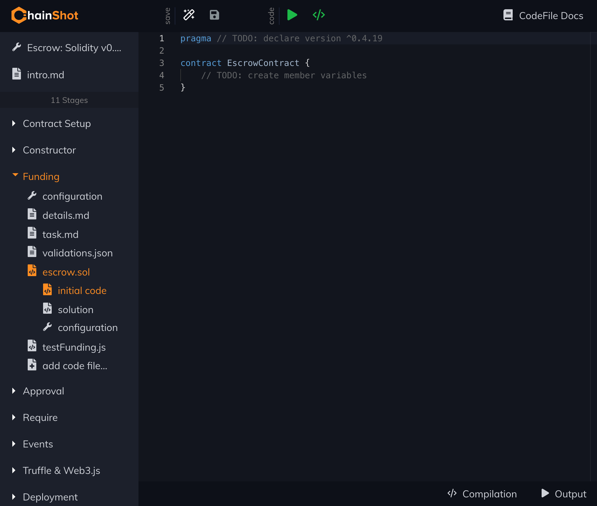

## ChainShot Builder

This is the Content Building application for ChainShot-style educational content.
The Output of the Builder is [Content Repositories](https://github.com/ChainShot/Content)
which can be setup to deploy automatically to ChainShot for live user audiences.

ChainShot Builder is for teachers, meetup hosts, hackathon organizers; ChainShot Builder
is for anyone excited to builder educational coding content! Build [Challenges](https://chainshotbuilder.readthedocs.io/en/latest/container_types.html#challenges), write [Lessons]((https://chainshotbuilder.readthedocs.io/en/latest/container_types.html#lessons)),
design [Building Blocks](https://chainshotbuilder.readthedocs.io/en/latest/container_types.html#building-blocks).

Check out the [Builder Documentation](https://chainshotbuilder.readthedocs.io/en/latest/) to learn more.
