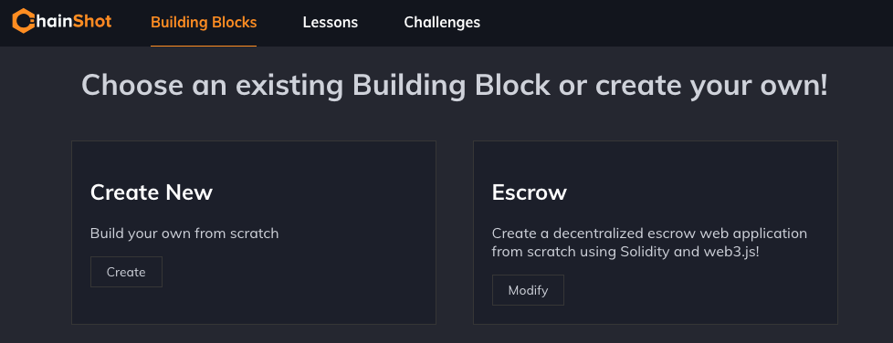

#####################
Fork Existing Content
#####################

The beautiful thing about open-source content repositories is you don't need
anyone's permission to fork their content and begin making your own modifications!

Let's see how to go about cloning a content repository and hosting it on ChainShot.

Forking a Content Repository
============================

Once you find a content repository that you'd like to fork you can do so from Github.
For example for the |ChainShot Content|:

.. |ChainShot Content| raw:: html

   <a href="https://github.com/ChainShot/Content" target="_blank">ChainShot Content Repository</a>

.. image:: fork.png
  :alt: Forking Content
  :align: left

Then you can clone your forked repository and start editing it with the Builder!

Point the Builder
=================

To edit your forked repository with the Builder, be sure to follow the
instructions for :ref:`setting_up` if you haven't already.

After you do so, you'll want to configure the builder to point at your content repository.

By default, the builder will look for a directory called `Content` on it's same
directory level. If you'd like to configure this, see :ref:`_server_configuration`.

Making Updates
==============

You'll know when you've successfully configured the Builder if the content
appears within your Builder UI:

To make updates to the content you can simply click modify and start working
within the editor! All changes will be saved directly to your file system,
and you'll be able to commit them to your content repository as necessary.
