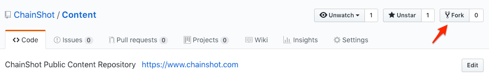

#####################
Fork Existing Content
#####################

The beautiful thing about open-source content repositories is you don't need
anyone's permission to fork their content and begin making your own modifications!

Let's see how to go about cloning a content repository and hosting it on ChainShot.

Forking a Content Repository
============================

Once you find a content repository that you'd like to fork you can do so from Github.
For example for the |ChainShot Content|:

.. |ChainShot Content| raw:: html

   <a href="https://github.com/ChainShot/Content" target="_blank">ChainShot Content Repository</a>

Then you can clone your forked repository and start editing it with the Builder!

Point the Builder
=================

To edit your forked repository with the Builder you'll want to install
:code:`chainshot-builder` globally using :code:`npm` if you haven't already:

::

  npm i chainshot-builder -g

Once you've done that, you'll want to navigate your forked repository, then simply:

::

  cd path/to/my/repo
  chainhshot-builder

The app will spin up and you'll be ready to start making updates! Any changes made
within the app will update your file system and can be committed back up to Github.
