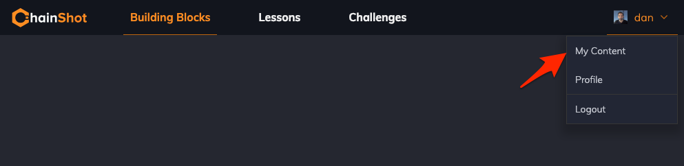
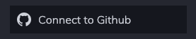
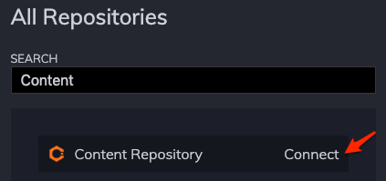
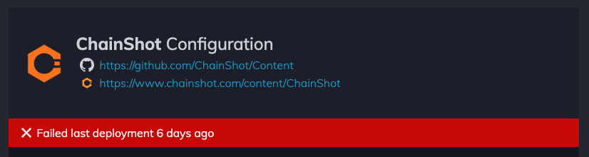
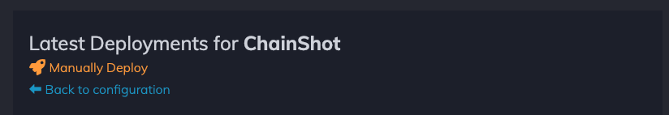

.. _linking_github:

###########################
Linking your Github Account
###########################

Once you have your Content repository up on Github you'll be able to link to it
from ChainShot to hook up to automatic deployments. ChainShot will transform your
content repository into interactive tutorials. Any changes to your content repository
will automatically be reflected on the ChainShot site.

Connect to Github
-----------------

To connect your ChainShot account, visit `ChainShot <https://www.chainshot.com>`_.
Navigate to "My Content" in your profile dropdown ChainShot:

Or follow this link to |Your Content|.

.. |Your Content| raw:: html

   <a href="https://www.chainshot.com/content/mine" target="_blank">Your Content</a>

You'll have to connect your Github account via oauth:

And then you'll be able to connect your Content Repository:

Github Webhook
--------------

Once you have hooked up your Content repository on ChainShot a webhook will be
created on your Github repository. This webhook will automatically notify ChainShot
when changes are made to your Github repository so that the new Content can be deployed.

You can view the status of the latest deployments on your deployments page:

Manual Deployment
-----------------

If your deployments ever fail for some reason you can always kick off a manual deployment:

For any help or assistance on why your content has failed deployment, reach out to
ChainShot administrators on
`Slack <https://join.slack.com/t/chainshotnodes/shared_invite/enQtMzU3ODc5NTM3MTI3LTFlZTY1YzcwM2QzYWI0ODY2ZDczMmYzOTVlYWQwZjkyZDFlYzUxZWM4NDNlNjk3N2EyNGMwOGQ0ZTVkZjQyNjE>`_
and we'll get you set up :)
